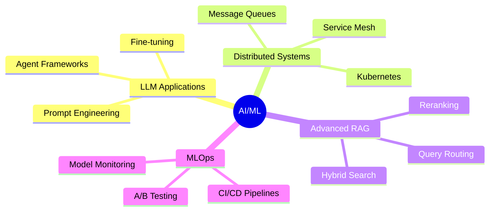

<div align="center">

# 👋 Hi, I'm Dron Haritwal

### AI Engineer | Data Science Enthusiast | Gen AI | Full Stack


[](https://linkedin.com/in/dronharitwal)
[](mailto:dronharitwal123@gmail.com)
[](dronharitwalportfolio.vercel.app)

</div>

---

## 🎯 About Me

> Architecting intelligent systems that bridge the gap between cutting-edge AI research and production deployment

Currently researching **multi-agent financial analysis platforms** at **Ontario Tech University**, with a focus on:
- 🤖 Building RAG-based systems and agentic workflows
- 🏗️ Developing full-stack AI-powered platforms
- 📊 Applying ML/NLP to domain-specific challenges

---

## 🛠️ Tech Stack

<div align="center">

### Languages & Frameworks


### AI/ML & Data


### Databases & Cloud


</div>

---

## 🚀 What I Build

<table>
<tr>
<td width="50%">

### 🤖 AI & LLM Systems
- RAG pipelines with advanced retrieval
- Multi-agent orchestration frameworks
- Context-aware chatbots & assistants
- NL-to-SQL query engines

</td>
<td width="50%">

### 💻 Full Stack Applications
- Real-time analytics dashboards
- AI-powered SaaS platforms
- Microservices architectures
- Scalable backend systems

</td>
</tr>
</table>

---

## 📊 GitHub Stats

<div align="center">


</div>

<div align="center">


</div>

---

## 🎓 Research & Projects

```python
current_focus = {
    "research": "Multi-Agent Financial Analysis Platform",
    "institution": "Ontario Tech University",
    "areas": ["LLM Orchestration", "RAG Systems", "Agent Frameworks"],
    "applications": ["Finance", "Resume Analysis", "Video Q&A"]
}
```

---

## 🌱 Currently Exploring

<div align="center">



</div>

---

## 💡 Philosophy

<div align="center">

> *"Turning complex problems into elegant AI-powered solutions"*

**🎯 Goal-Driven** • **🔬 Research-Oriented** • **🚀 Production-Focused**

</div>

---

## 📫 Let's Connect

<div align="center">

**Open to collaborating on innovative AI/ML projects and exploring new frontiers in distributed systems**

[](https://linkedin.com/in/your-profile)
[](mailto:dh4829@srmist.edu.in)
[](#)


</div>

---

<div align="center">

</div>
